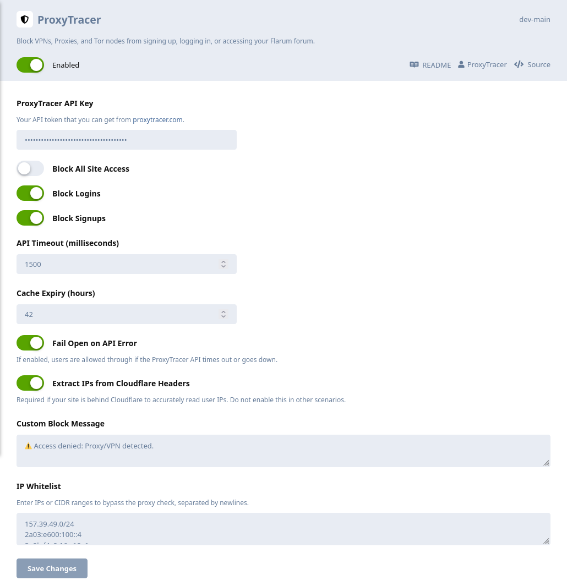

# ProxyTracer for Flarum

The official [ProxyTracer](https://proxytracer.com/) integration for [Flarum](https://flarum.org/). This extension brings enterprise-grade IP intelligence to your community, automatically detecting known VPNs, proxies, datacenters, and Tor nodes, and giving you the option of preventing them from registering, logging in, or viewing your Flarum forum entirely.

## Features

* Granular control allowing administrators to enforce IP validation during new user registrations, existing user authentication, or globally for all site visitors.
* Built-in caching utilizing Flarum's native Laravel Cache API stores recent IP address evaluations, drastically reducing external API calls and ensuring zero latency.
* In the event of an API timeout or network failure, the extension prioritizes user access (fail-open) to prevent wide-scale lockouts. This behavior can be toggled in the settings.
* Built-in support for exact IP and CIDR subnet whitelisting (e.g., `192.168.1.0/24`).

## Installation

1. Access your server via SSH and navigate to your Flarum root directory (where your `composer.json` is located):
   ```bash
   cd /var/www/flarum
   ```

2. Install the extension via Composer:
   ```bash
   composer require proxytracer/flarum-proxytracer
   ```

3. Clear your Flarum cache to compile the new frontend assets:
   ```bash
   php flarum cache:clear
   ```

## Configuration

1. Procure a standard API key from the [ProxyTracer Dashboard](https://proxytracer.com/dashboard).
2. Navigate to your Flarum administration panel: **Admin → Features → ProxyTracer** to open the settings modal.
3. Input your API key into the `API Key` field.
4. Enable the protection parameters by toggling `Block Signups`, `Block Logins`, and/or `Block All Site Access`.
5. Add any trusted IPs or CIDR ranges to the `IP Whitelist` (one per line).
6. (Optional) Adjust the API timeout and Cache Expiry limits to suit your server's specific traffic requirements.
7. (Optional) Customize the Block Message that appears to blocked users. For instance, you can add instructions for contacting the administration of the site in case they believe that the block isn't warranted and that they're not accessing the site through a proxy or VPN.

<p align="center">
  
</p>

## Network Configuration: Cloudflare & Reverse Proxies

> [!IMPORTANT]
> **For ProxyTracer to function effectively, the Flarum application must receive the true client IP address.** If your infrastructure utilizes Cloudflare or another reverse proxy, Flarum may default to logging the proxy node's IP address (like Cloudflare's edge servers), making ProxyTracer's job unreliable.

Please follow the configuration guidelines below that match your server's architecture to ensure accurate IP forwarding.

### Direct Cloudflare Integration (Standard Installation)

If your Flarum server connects directly to the internet and utilizes Cloudflare exclusively for DNS and edge proxying, you can use the extension's built-in Cloudflare bypass. 

Inside the ProxyTracer Flarum settings, simply toggle on **Extract IPs from Cloudflare Headers**. 

ProxyTracer will automatically extract the true client IP from Cloudflare's proprietary `CF-Connecting-IP` header. **Note:** Only enable this setting if your server is directly facing Cloudflare. Enabling this on a non-Cloudflare setup could allow malicious users to bypass restrictions by spoofing their IP headers.

### Multi-Layer Proxy Architecture (Cloudflare + Local Reverse Proxy)

This applies if your Flarum instance is routed through a local server management panel or reverse proxy (e.g., Nginx Proxy Manager, CloudPanel, Traefik, Plesk) which sits *behind* Cloudflare. In a multi-layer (or "double") reverse proxy architecture, the simple toggle is not enough because the traffic is handed to Flarum by your local network interface, not directly by Cloudflare. 

You must configure your local reverse proxy to extract the true client IP from the `CF-Connecting-IP` header, **but only for traffic originating from trusted Cloudflare IP addresses**. Blindly passing this header without verifying the source allows malicious users to bypass rate limits and bans by spoofing their IP address.

**Nginx Example:**
First, define Cloudflare's IP ranges as trusted proxies in your server block configuration (outside of your location block). *Hardcoding these IPs at the Nginx level provides the absolute highest level of speed and security.*

```nginx
# IPv4 Cloudflare IPs, see [https://www.cloudflare.com/ips/](https://www.cloudflare.com/ips/)
set_real_ip_from 173.245.48.0/20;
set_real_ip_from 103.21.244.0/22;
set_real_ip_from 103.22.200.0/22;
set_real_ip_from 103.31.4.0/22;
set_real_ip_from 141.101.64.0/18;
set_real_ip_from 108.162.192.0/18;
set_real_ip_from 190.93.240.0/20;
set_real_ip_from 188.114.96.0/20;
set_real_ip_from 197.234.240.0/22;
set_real_ip_from 198.41.128.0/17;
set_real_ip_from 162.158.0.0/15;
set_real_ip_from 104.16.0.0/13;
set_real_ip_from 104.24.0.0/14;
set_real_ip_from 172.64.0.0/13;
set_real_ip_from 131.0.72.0/22;

# IPv6 Cloudflare IPs
set_real_ip_from 2405:b500::/32;
set_real_ip_from 2405:8100::/32;
set_real_ip_from 2803:f800::/32;
set_real_ip_from 2c0f:f248::/32;
set_real_ip_from 2a06:98c0::/29;

real_ip_header CF-Connecting-IP;
```

Next, locate your `location /` directive. Because of the configuration above, Nginx will now safely resolve `$remote_addr` to the true client IP only if the request actually passed through Cloudflare. Modify your IP forwarding headers as follows:

```nginx
location / {
    proxy_set_header X-Real-IP $remote_addr;
    proxy_set_header X-Forwarded-For $proxy_add_x_forwarded_for;

    ...    
}
```

Save the configuration and reload your Nginx service (`systemctl reload nginx`).

### Emergency Access 

> [!TIP]
> **Locked out?** If you accidentally block your own IP address while configuring ProxyTracer (e.g., you are currently connected to a VPN and have "Block All" enabled), you can regain access by disabling the extension directly via SSH:
>
> ```bash
> cd /var/www/flarum
> php flarum extension:disable proxytracer-proxytracer
> php flarum cache:clear
> ```
> *(If you are using Docker, run these commands inside your PHP container).*
> 
> Alternatively, you can disable it via the database: open your `settings` table, locate the `proxytracer.block_all` key, change its value to `0`, and run `php flarum cache:clear`.

## License

This software is licensed under the GNU Affero General Public License v3.0 (AGPLv3). See the `LICENSE` file for full details.
